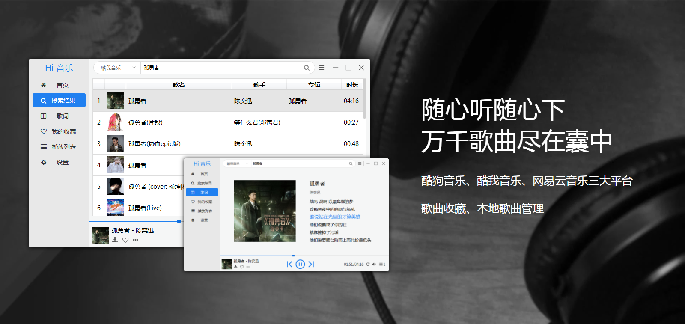
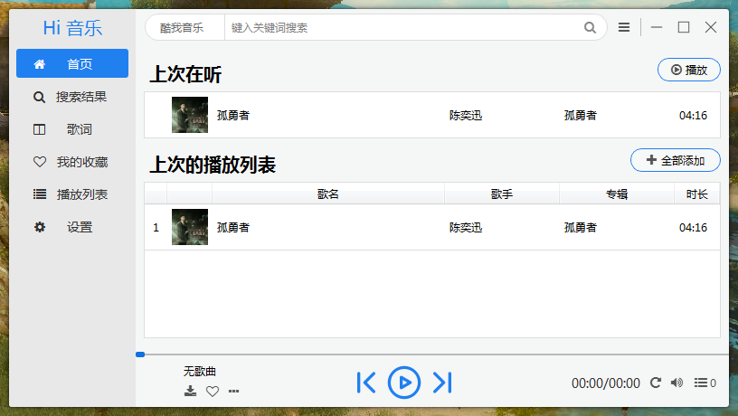
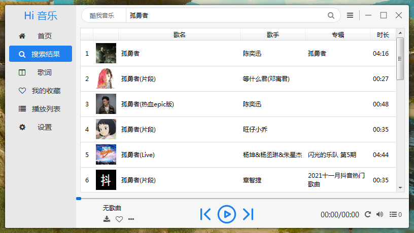
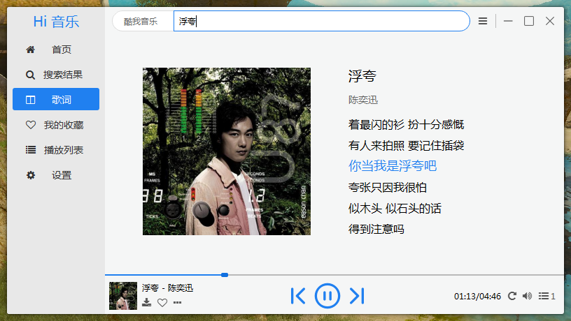
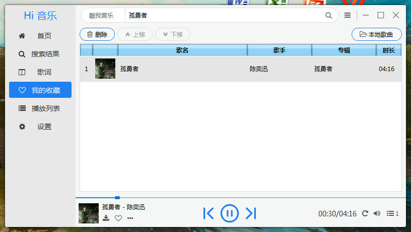
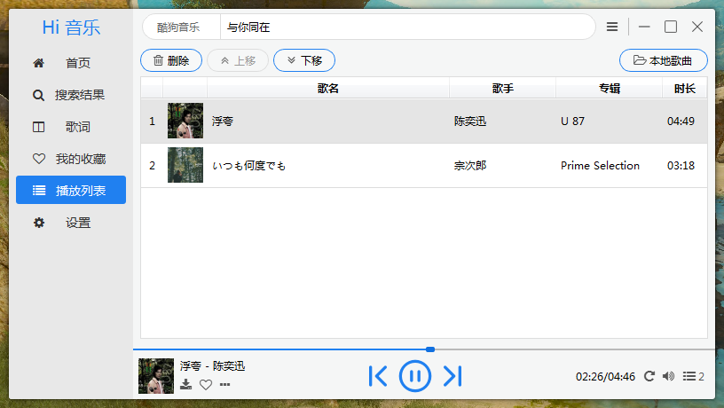
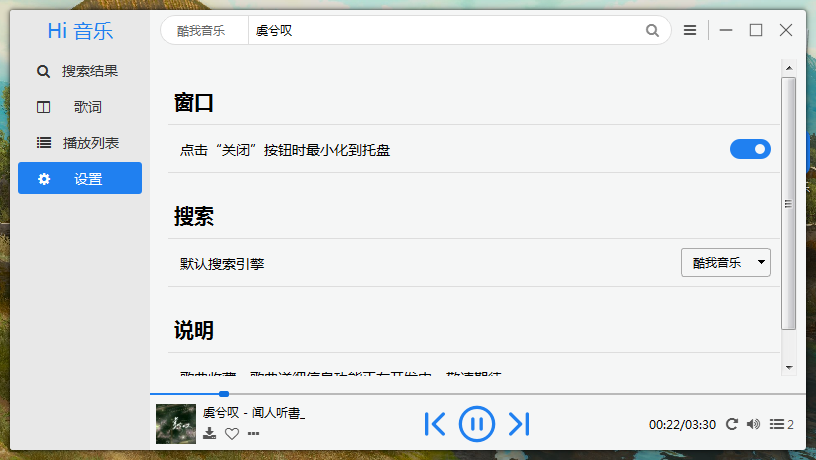

<h1 align="center">Hi音乐</h1>

<p align="center">三大平台全音乐搜索、收听与下载的简洁网络音乐播放器</p>

<p align="center">
<a href="./README.md">中文介绍</a> |
<a href="./README_en.md">English Description</a> 
</p>
<p align="center">
	
	
	
</p>

<p align="center">
	源码 :
	<a href="https://gitee.com/hi-jie/himusic">Gitee 码云</a>
</p>

## 简介

`Hi音乐` 是基于 `Python` 开发的简洁网络音乐播放器，支持酷狗音乐、酷我音乐、网易云音乐三大平台全音乐搜索、收听与下载。如果你厌倦各种音乐软件繁多的广告和多余冗杂的设计，那么 `Hi音乐` 是你最佳的选择。

## 功能特性

### **基础功能**

- 集成酷狗音乐、酷我音乐、网易云音乐歌曲搜索与下载（未来将会支持更多的平台）

- 歌词同步滚动与歌曲进度控制，舒适的听歌体验

- 播放列表快捷操作，方便地管理歌曲

- 歌曲收藏夹，快速保存你喜欢的音乐

### **与其他播放器相比**

- 界面简洁美观高端大气，现代化扁平风格

完整更新记录详见：[CHANGES.md](CHANGES.md)

## 简明运行教程

使用前请确保您已经在电脑上安装好了 `Python`。如果未安装，可以在官网（[www.python.org/downloads/](https://www.python.org/downloads/)）下载。

### 1、安装依赖库

#### 方法一（推荐）

直接运行文件夹下 `requirements.bat` 批处理文件自动安装依赖库。

#### 方法二

快捷键 `Win+R`，输入 `cmd` 回车打开命令行，运行 `pip` 安装命令。

连接 Python 官方 Pypi 安装很慢，推荐使用国内 **清华镜像** 安装：

```batch
pip install -r requirements.txt -i https://pypi.tuna.tsinghua.edu.cn/simple
```

### 2、运行

直接双击运行 `run.pyw` 文件。

如果双击运行闪退或打不开，请按照下述方法尝试。

#### 运行错误

快捷键 `Win+R` 输入 `cmd` 回车打开命令行，输入以下命令运行：

```batch
python -m run.pyw
```

如果未能运行成功且出现报错信息，请通过 Issue（[https://gitee.com/hi-jie/himusic/issues](https://gitee.com/hi-jie/himusic/issues)）告诉我。

如果您知道如何解决该问题，也可自行修改并告诉我修改方法。

## 运行截图

首页



搜索歌曲



歌词界面



收藏列表



播放列表



设置界面



## 交流

微信：JIE（ZZJ_zzh）

QQ：3318897344

CSDN：[张大帅哥](https://blog.csdn.net/weixin_48448842?type=blog)

博客园：[张大帅哥喔](https://www.cnblogs.com/hi-jie/)

## 依赖

HiMusic基于以下项目进行开发，在此表示感谢：

- Python
- requests
- PyQt5

## 协议

<a href="./LICENSE">GPL-3.0</a>

开源版的使用者必须保留 Hi音乐 相关版权标识，禁止对 Hi音乐 相关版权标识进行修改和删除。

如果违反，开发者保留对侵权者追究责任的权利。

---

<br/>

<p align="center">
	<a href='https://gitee.com/hi-jie/himusic/stargazers'>
		</img>
	</a>
	<a href='https://gitee.com/hi-jie/himusic/members'>
		</img>
	</a>
</p>

<p align="center">
	<a href='https://gitee.com/hi-jie/himusic'>
		</img>
	</a>
</p>