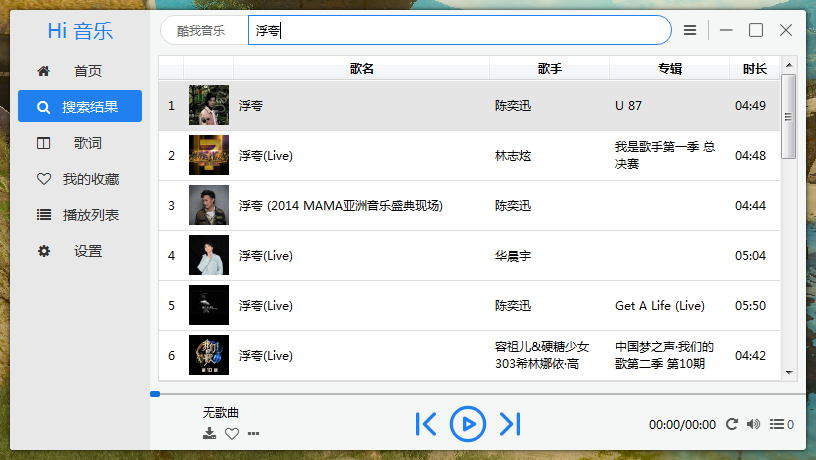

<h1 align="center">Hi音乐</h1>

<p align="center">两大平台全音乐搜索、收听与下载的简洁网络音乐播放器</p>

<p align="center">
<a href="./README.md">中文介绍</a> |
<a href="./README.en.md">English Description</a> 
</p>


<p align="center">
	
	
	
</p>

<p align="center">源码：<a href="https://gitee.com/hi-jie/HiMusic">Gitee 码云</a></p>

## 简介

`Hi音乐` 是基于 `Python` 开发的简洁网络音乐播放器。

## 功能特性

### **基础功能**

- 集成酷狗音乐、酷我音乐歌曲搜索与下载（未来将会支持更多的平台）

- 支持歌词同步滚动，进度条控制音乐进度

- 多种播放模式选择

完整更新记录详见：[CHANGES.md](./CHANGES.md)

## 简明运行教程

使用前请确保您已经在电脑上安装好了 `Python 3.8+`。

### 1、安装依赖库

快捷键 `Win+R` 输入 `cmd` 回车打开命令行，运行 `pip` 安装命令。

连接 Python 官方 Pypi 安装很慢，因此推荐使用国内 **清华镜像** 安装：

```batch
pip install -r requirements.txt -i https://pypi.tuna.tsinghua.edu.cn/simple
```

或者运行文件夹下 `requirements.bat` 批处理文件自动安装依赖库。

### 2、运行

快捷键 `Win+R` 输入 `cmd` 回车打开命令行，输入以下命令运行：

```batch
python -m run.pyw
```

或者双击运行 `run.pyw` 文件。

## 运行截图

搜索歌曲



歌词界面


播放列表


## 交流

<p>微信：JIE（ZZJ_zzh）</p>

## 依赖

HiMusic基于以下项目进行开发，在此表示感谢：

- Python
- requests
- PyQt5

## 协议

<a href="./LICENSE">GPL-3.0</a>

开源版的使用者必须保留 Hi音乐 相关版权标识，禁止对 Hi音乐 相关版权标识进行修改和删除。

如果违反，开发者保留对侵权者追究责任的权利。