# 使用详解

## 首页

首页会显示用户上次正在听的歌曲和上次的播放列表。

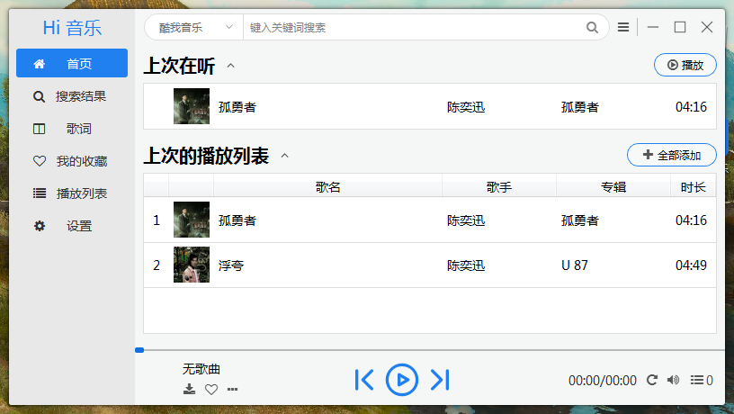

如果不想显示，单击标题旁的箭头即可收起。

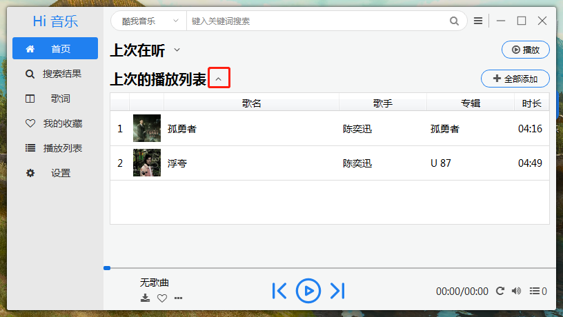

单击“播放”播放上次在听的歌曲。单击“全部添加”把上次的播放列表添加到当前播放列表中。

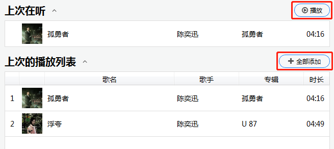

## 搜索

界面上方搜索栏搜索关键词，回车或点击右侧搜索按钮搜索歌曲。

输入框右侧可以选择搜索引擎。

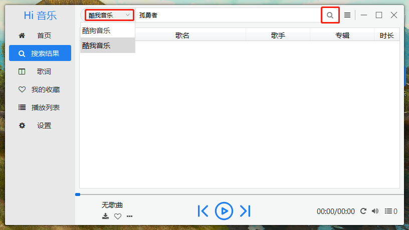

## 收藏

右键单击任意歌曲，在菜单中选择“收藏”即可收藏。

点击进度条下方收藏按钮收藏当前正在播放歌曲。

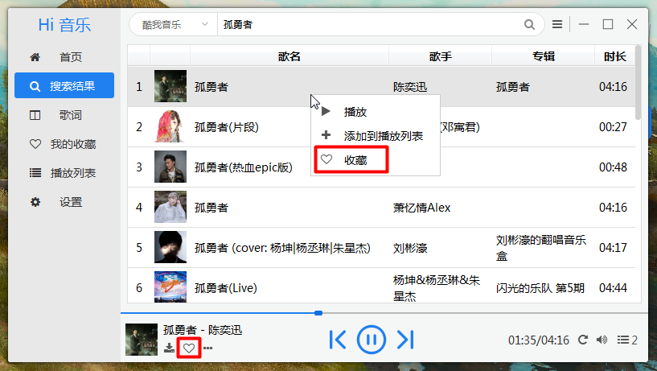

点击左侧菜单中“我的收藏”即可查看已收藏歌曲。

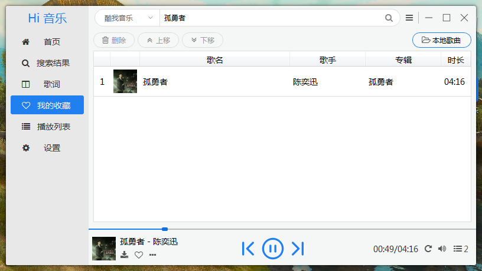

## 播放列表

点击左侧菜单栏“播放列表”或右下角按钮进入播放列表界面。

播放列表显示当前播放的歌曲和添加进播放列表的歌曲。

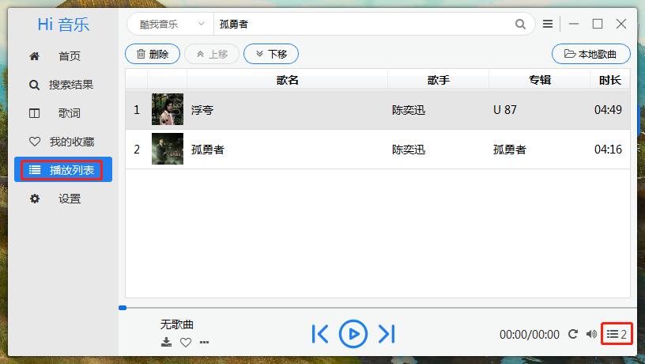

在任意歌曲列表右键单击歌曲，选择“添加到播放列表”即可添加到播放列表。

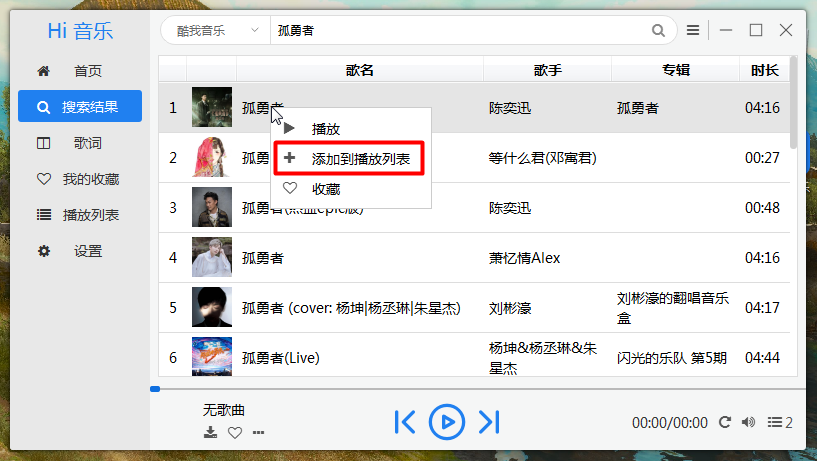

## 歌曲操作

在播放列表和收藏列表中，列表上方的操作栏可对歌曲进行上移、下移、删除等操作，也可从本地添加歌曲。

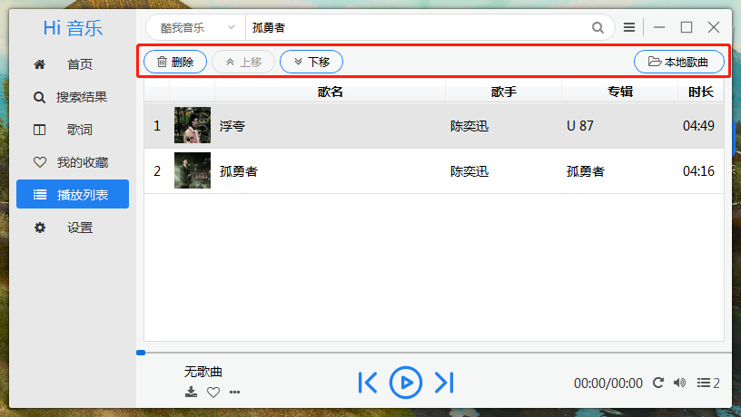

进度条下方按钮说明：

- 上一曲（快捷键：←)
- 暂停、继续播放（快捷键：空格)
- 下一曲（快捷键：→)
- 下载
- 收藏

- 播放模式（顺序依次为：单曲循环、顺序播放、列表循环、随机播放、播放一次)
- 播放音量
- 打开播放列表。

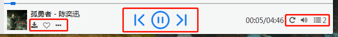

## 歌词

左侧菜单栏选择“歌词”，即可跳转到歌词界面。

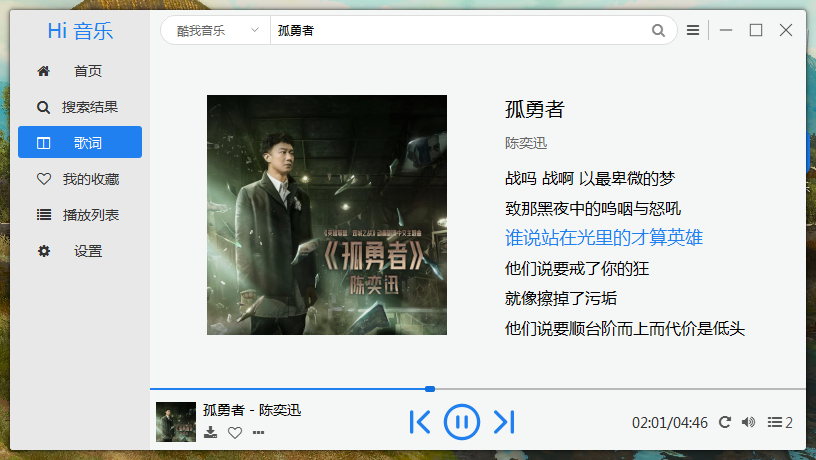

鼠标滚轮滚动歌词可以上下查看歌词，双击一句歌词可跳转到歌词对应的位置播放。

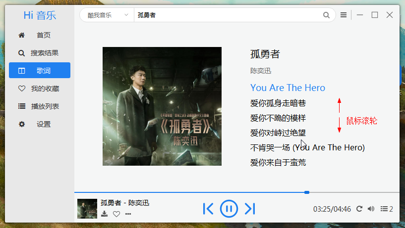

## 其他

### 调整窗口大小

把光标移到窗口右下角，出现箭头样式时，按住拖动即可调整窗口大小。

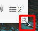
